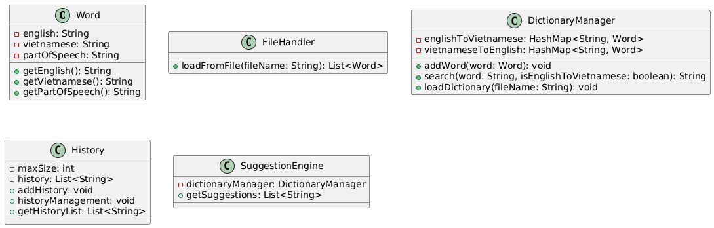

# Dictionary Project

## 1. Xác định yêu cầu

### **Yêu cầu chức năng:**
- Thêm từ mới vào từ điển.
- Tìm kiếm từ trong từ điển bằng tiếng Anh hoặc tiếng Việt.
- Hiển thị thông tin từ bao gồm nghĩa và loại từ.
- Tải từ điển từ tệp văn bản.
- Giao diện người dùng đơn giản cho việc tìm kiếm.

### **Yêu cầu phi chức năng:**
- Hiệu suất tìm kiếm phải nhanh (độ phức tạp O(1)).
- Giao diện người dùng thân thiện và dễ sử dụng.
- Xử lý lỗi khi không tìm thấy từ hoặc gặp sự cố khi tải tệp.
- Kiểm tra lại kiến thức người dùng.

---

## 2. Phân tích thiết kế ra lớp

### **Các lớp cần thiết:**

#### Đối với `dictionary` package:
- **`Word`**: Lớp đại diện cho một từ trong từ điển.
- **`DictionaryManager`**: Lớp quản lý từ điển và các thao tác liên quan đến từ.
- **`History`**: Lớp lưu lại lịch sử tìm kiếm.
- **`SuggestionEngine`**: Lớp đưa ra gợi ý khi nhập.
- **`DictionaryGUI`**: Lớp tạo giao diện người dùng.

#### Đối với `memorytest` package:
- **`MemoryTestManager`**: Lớp quản lý từ cần kiểm tra và các thao tác liên quan đến từ.
- **`FaceFrame`**: Lớp quản lý giao diện trước khi test.
- **`MemoryGUI`**: Lớp quản lý giao diện trong khi test.

---

## 3. Biểu đồ lớp (UML)

Dưới đây là mô tả về biểu đồ lớp UML cho dự án từ điển:

### **Đối với `dictionary` package:**

#### **`Manager` Interface:**
- **Phương thức:**
  - `+ addWord(word: Word): void`
  - `+ search(word: String, isEnglishToVietnamese: boolean): String`
  - `+ loadDictionary(filename: String): void`
  - `+ getEnglishWords(): List<String>`
  - `+ getVietnameseWords(): List<String>`
  - `- loadFromFile(filename: String): List<Word>`
  - `+ getMapEnglishWords(): HashMap<String, Word>`
  - `+ getMapVietnameseWords(): HashMap<String, Word>`

#### **Lớp `Word`:**
- **Thuộc tính:**
  - `- english: String`
  - `- vietnamese: String`
  - `- partOfSpeech: String` (loại từ)
- **Phương thức:**
  - `+ getEnglish(): String`
  - `+ getVietnamese(): String`
  - `+ getPartOfSpeech(): String`

#### **Lớp `DictionaryManager`:**
- **Thuộc tính:**
  - `+ englishToVietnamese: HashMap<String, Word>`
  - `+ vietnameseToEnglish: HashMap<String, Word>`
- **Phương thức:**
  - `+ addWord(word: Word): void`
  - `+ search(word: String, isEnglishToVietnamese: boolean): String`
  - `+ loadDictionary(filename: String): void`
  - `+ getEnglishWords(): List<String>`
  - `+ getVietnameseWords(): List<String>`
  - `- loadFromFile(filename: String): List<Word>`
  - `+ getMapEnglishWords(): HashMap<String, Word>`
  - `+ getMapVietnameseWords(): HashMap<String, Word>`

#### **Lớp `SuggestionEngine`:**
- **Thuộc tính:**
  - `- dictionaryManager: DictionaryManager`
- **Phương thức:**
  - `+ getSuggestedWords(prefix: String): List<String>`

#### **Lớp `History`:**
- **Thuộc tính:**
  - `- searchHistory: List<String>`
- **Phương thức:**
  - `+ addToHistory(word: String): void`
  - `+ getHistory(): List<String>`

#### **Lớp `DictionaryGUI`**: Quản lý giao diện người dùng cho việc tìm kiếm từ.

---

### **Đối với `memorytest` package:**

#### **Lớp `MemoryTestManager`:**
- **Thuộc tính:**
  - `+ englishToVietnamese: HashMap<String, Word>`
  - `+ vietnameseToEnglish: HashMap<String, Word>`
- **Phương thức:**
  - `+ addWord(word: Word): void`
  - `+ search(word: String, isEnglishToVietnamese: boolean): String`
  - `+ loadDictionary(filename: String): void`
  - `+ getEnglishWords(): List<String>`
  - `+ getVietnameseWords(): List<String>`
  - `- loadFromFile(filename: String): List<Word>`
  - `+ getMapEnglishWords(): HashMap<String, Word>`
  - `+ getMapVietnameseWords(): HashMap<String, Word>`

#### **Lớp `FaceFrame`**: Quản lý giao diện trước khi test.

#### **Lớp `MemoryGUI`**: Quản lý giao diện trong khi test.

---

---

