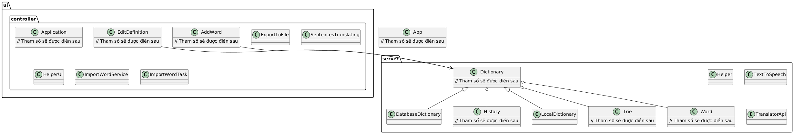

Đây là uml của bài tập lớn.

An English-to-Vietnamese dictionary with a full-fledged words' database.
Many features:
Search Vietnamese meaning.
Add words.
Insert words from file.
Export words to file.
Edit words.
Delete words.
Google Translate translate sentences (Both from English to Vietnamese and Vietnamese to English).
Switching between Light Mode and Dark Mode (TokyoNight colorscheme).
